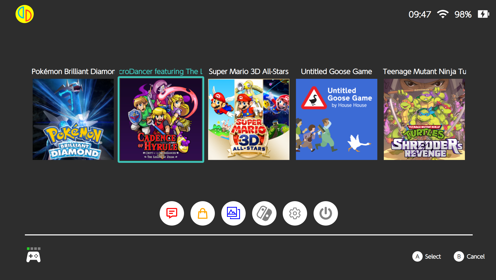

# SwitchHomeMenu-React-Tauri

The **Nintendo Switch HorizonOS** home menu remade with **ReactJS + Typescript + Tauri + Rust***.

## Disclaimer
- All right related to the Nintendo Switch and games are properties of Nintendo.
- you should add your own owned prod.keys 

## Features
- Show all games (NSP) specified path in config.cfg
- Navigate between games in list
- Real time system information displayed: time, connection status, battery file and state
- Launch selected game using yuzu-cmd.exe specified in emu.cfg

## Requirements for building
- Yarn and Tauri
- Rust installed
- nstool.exe, only the version forked in [my repo](https://github.com/TsilaAllaoui/nstool) work because i edited it manually to do what is necessary (should be already included in the release)
- prod.keys (needed to be placed at the same level as nsool.exe and the built binary)
- edit config.cfg and emu.cfg for paths

## Building
- Just run yarn tauri dev to test locally and debug or yarn tauri build to build binary file 

## Credits
- [jakcron](https://github.com/jakcron) for his version of [nstool](https://github.com/jakcron/nstool) that i have forked 

## Screenshots

## Future features
- Add controller (xbox, joycons, pro controller) support
- Add user and HorizonOS settings navigation